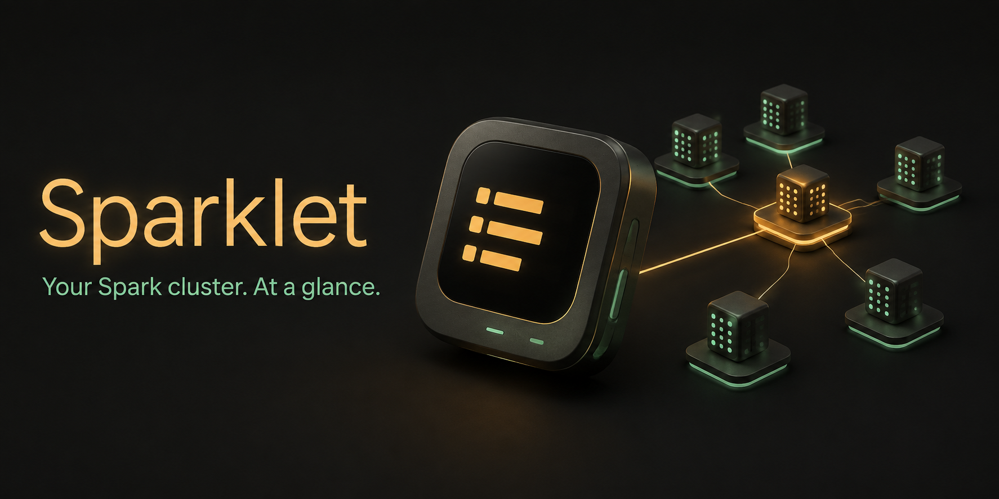
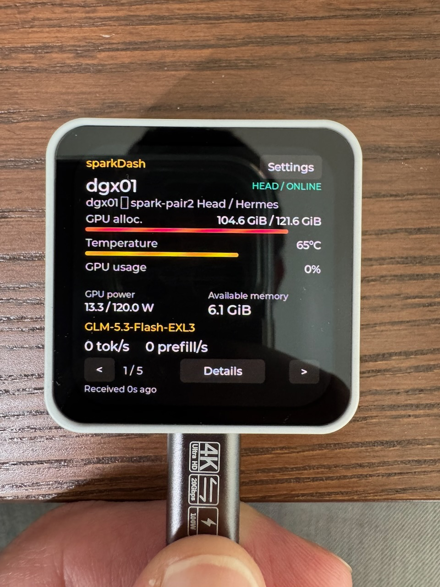
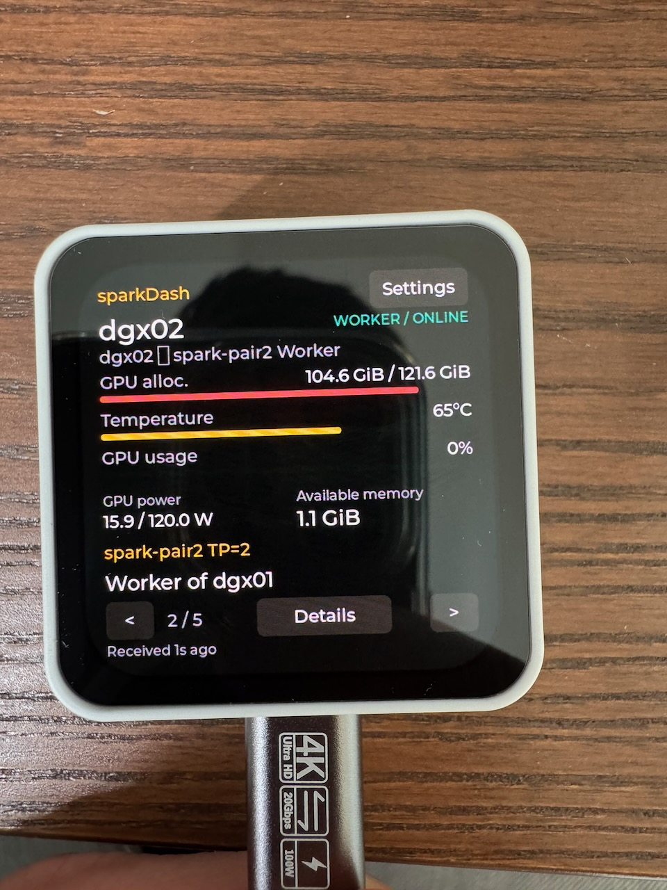
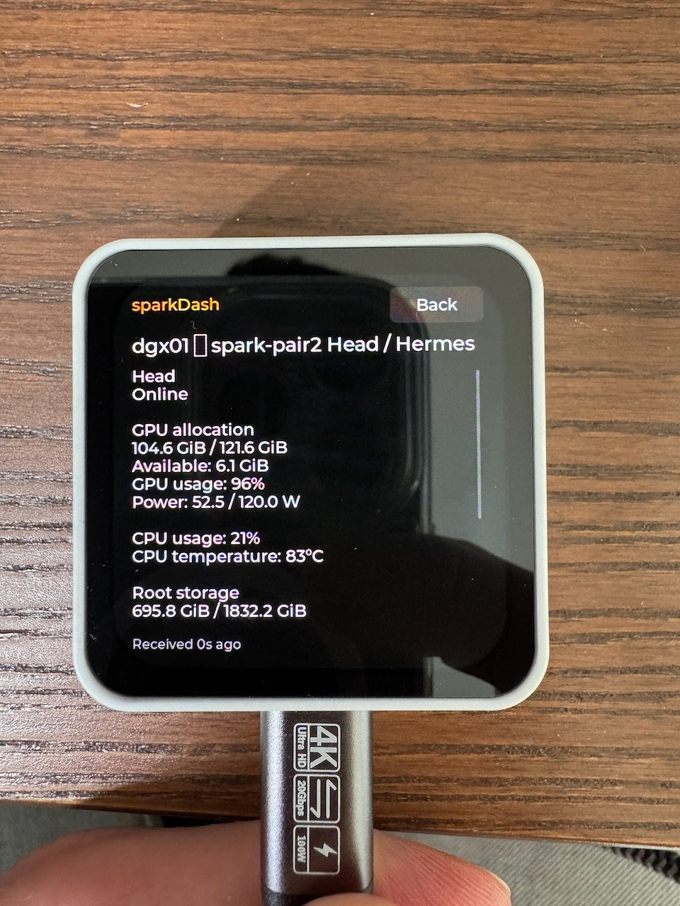

# Sparklet



**A little screen for a lot of compute.**

Sparklet turns a Waveshare ESP32-C6 AMOLED touchscreen into a native, Wi-Fi-connected companion for [sparkDash](https://github.com/MiaAI-Lab/sparkDash). Swipe through your DGX nodes, check GPU allocation and temperature, and see which model is running—all from a small display on your desk.

One node at a time. Real metrics from your existing server. No server changes.

> **V1 status:** phone setup and live five-node operation have been demonstrated on the actual board. V1 implements the daily-use dashboard and has passed bounded setup, transport, memory and interaction checks. The earlier USB stall recovered after physical reconnection; its cause was not isolated. See the [validation report](docs/sparkdash-validation.md). The 24-hour soak test is explicitly excluded.

## On the real device

These are user-supplied photographs of an earlier development build, not generated UI mockups.

<table>
  <tr>
    <td width="33%"></td>
    <td width="33%"></td>
    <td width="33%"></td>
  </tr>
  <tr>
    <td align="center"><strong>Head node</strong></td>
    <td align="center"><strong>Worker node</strong></td>
    <td align="center"><strong>Node details</strong></td>
  </tr>
</table>

The missing-glyph rectangle visible in these photos was subsequently addressed with display-only punctuation normalization. The corrected dash and navigation/dim-wake behavior were subsequently confirmed on the physical device. The cover above is an original generated illustration; the photos preserve the actual recorded screen content. [Asset provenance](docs/assets/README.md)

## What it does

- **Browse your cluster:** discover up to 16 nodes in server order; swipe or tap arrows, with wraparound navigation.
- **Read the useful numbers:** GPU allocation, available memory, utilization, temperature and power; CPU, root storage and network rates in Details.
- **Understand node roles:** show the first available LLM backend on head/standalone nodes and the head relationship on workers.
- **Set up with your phone:** scan a Wi-Fi QR, scan the setup-page QR, then enter your local network and server details.
- **Keep running independently:** saved settings, automatic reconnect, cached data during outages and adjustable inactivity dimming.

Sparklet is read-only. It does not shut down, wake, update or otherwise control DGX nodes. “Received Ns ago” describes HTTP receipt time, not collector sample age. Missing values and valid zero are handled separately.

## Hardware

| Component | Configuration |
| --- | --- |
| Board | **Waveshare ESP32-C6-Touch-AMOLED-2.16** |
| Display | 480 × 480 AMOLED, capacitive touch |
| Network | Personal 2.4 GHz Wi-Fi |
| Framework | ESP-IDF **5.5.3**, target `esp32c6` |
| UI | LVGL 9; partial rendering with one 23,040-byte draw stripe |
| Power | Primarily USB |
| Server | Existing sparkDash HTTP API; default `http://dgx01.local:5555` |

This firmware targets that exact board. Its schematic-corrected display CS and touch interrupt are **GPIO15 and GPIO5**, respectively. Do not reuse an ESP32-S3 or another display-size pin map. [Hardware details](docs/hardware.md) · [Provenance](firmware/sparkdash/PROVENANCE.md)

## Get started

Download the [v1.0.0 firmware bundle and checksums](https://github.com/mfellner/sparklet/releases/tag/v1.0.0), or follow the source build instructions below.

With firmware installed:

1. Scan the display's **join setup Wi-Fi** QR code and accept joining `SparkDash-XXXX`.
2. Stay connected when your phone reports “No Internet Connection.” Tap **Next: setup page** and scan the URL QR, or open `http://192.168.4.1`.
3. Enter your personal 2.4 GHz Wi-Fi credentials and sparkDash URL in the local portal.
4. Save, wait for connection, then browse nodes with swipes or the arrow buttons.

The temporary setup password changes each session. Saved credentials survive ordinary firmware updates. The firmware currently keeps the on-device **sparkDash** label and the **SparkDash-XXXX** setup SSID; Sparklet is the project/repository name.

[Full user guide](docs/sparkdash/user-guide.md) · [Connection troubleshooting](docs/sparkdash/operations.md#troubleshooting)

## Build and test

Install the pinned ESP-IDF SDK outside the repository and activate its `export.sh`. From this repository's root:

```sh
idf.py -C firmware/sparkdash build

cmake -S tests/host -B tests/host/build
cmake --build tests/host/build
ctest --test-dir tests/host/build --output-on-failure
python3 tests/host/test_http_fixtures.py
```

The dependency lock and build defaults are committed. Shared-code tests use address/undefined-behavior sanitizers. Two separate build directories produced identical candidate firmware binaries; that is separate from runtime acceptance.

For hardware discovery, install [uv](https://docs.astral.sh/uv/) and run:

```sh
uv run scripts/esp32_serial.py list
```

Read the [build/flash guide](firmware/sparkdash/README.md) and [USB instructions](docs/interaction.md) before flashing. Preserve a verified full backup, select the correct USB identity, and use generated flash arguments. Opening USB serial can reboot the display. Factory and custom-snapshot restoration have been physically tested; backups remain private and outside Git.

## Documentation

Start with the [complete documentation index](docs/sparkdash/README.md).

| Guide | Covers |
| --- | --- |
| [User guide](docs/sparkdash/user-guide.md) | QR setup, controls, metric interpretation, Settings and dimming |
| [Architecture and API](docs/sparkdash/architecture.md) | Task ownership, bounded parsing, data mappings, polling and NVS |
| [Development](docs/sparkdash/development.md) | Pinned SDK, reproducible inputs and normal/QA builds |
| [Testing](docs/sparkdash/testing.md) | Host tests, real ESP32 failure tests, live API comparison and physical acceptance |
| [Release and operations](docs/sparkdash/operations.md) | Bundles, checksums, flashing, diagnostics and troubleshooting |
| [Validation status](docs/sparkdash-validation.md) | Verified results, failed checks and remaining work |
| [Recovery](docs/recovery.md) | Verified full-flash backup and restore procedure |
| [Bring-up notes](notes/2026-09-05-firmware-bringup.md) | Hardware discoveries and implementation evidence |

## Project layout

```text
firmware/sparkdash/     ESP-IDF application, board wrapper and shared core
scripts/               USB discovery and bounded serial monitoring
tests/host/           Shared-code sanitizer and HTTP fixture tests
tools/                Mock server, device validators and release packager
docs/                 User/developer guides and visual assets
notes/                Reviewed hardware and validation history
```

Generated builds, releases, raw logs, flash backups and local configuration are ignored. They are not part of the published source or public screenshots.

## Scope and credits

V1 focuses on the everyday node-card experience. OTA, charts/history, automatic slideshows, MQTT, Home Assistant, remote actions, audio, IMU, SD storage and battery management are outside this release.

Built around the [sparkDash](https://github.com/MiaAI-Lab/sparkDash) API and the [Waveshare board integration](https://github.com/waveshareteam/ESP32-C6-Touch-AMOLED-2.16), with ESP-IDF, LVGL and their managed components. [awesome-esp](https://github.com/agucova/awesome-esp) informed the initial exploration. The [research notes](docs/sparkdash-feasibility.md) and [source provenance](firmware/sparkdash/PROVENANCE.md) record the underlying references and license limitations; no blanket license grant for all upstream material is implied.
