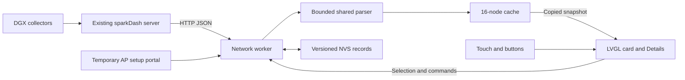

# Architecture and API

[Documentation index](README.md)

## Data flow and ownership



The server remains responsible for collection. The ESP32 uses one network worker with at most one metrics HTTP request in flight. That worker owns scheduling, name resolution, HTTP reception, parsing and configuration writes. It publishes values to a mutex-protected cache.

The LVGL task copies a `View` snapshot and updates widgets on a 100 ms application timer. A single Overview widget tree is reused across nodes. Switching between page types rebuilds the relevant tree; there is no full tree per discovered node and no sliding animation.

UI requests use an eight-entry command queue. Previous/next selection changes the cache under its mutex immediately, then queues a scheduling notification. This avoids waiting for a blocking HTTP call before browsing cached data. HTTP, DNS, Wi-Fi scanning and NVS writes do not run while holding the LVGL lock.

A USB diagnostics task accepts the documented commands. An ESP timer enforces the overall request deadline with a protected active-client handle. The HTTP setup server runs only during setup. Parsing uses its own serialization guard; normalized values are copied out before the arena is reused.

## Source map

| File / directory | Responsibility |
| --- | --- |
| `firmware/sparkdash/main/main.cpp` | Board, network, UI and diagnostics startup |
| `main/app.hpp` | Shared command/view declarations and state interfaces |
| `main/network.cpp` | Wi-Fi, mDNS/DNS, HTTP, scheduling, cache publication, NVS |
| `main/portal.cpp` | Embedded HTML/JS, setup HTTP routes, session token |
| `main/portal_address.hpp` | Setup-interface destination guard |
| `main/ui.cpp` | Pages, labels, bars, gestures, QR codes and dimming |
| `main/diagnostics.cpp` | Normal and compile-time validation USB commands |
| `components/board/` | Panel, touch, PMIC reset and LVGL adapter integration |
| `components/core/include/core.hpp` | Bounded normalized model and shared interfaces |
| `components/core/core.cpp` | Parsing, URLs/forms, formatting, list reconciliation, scheduler |
| `tests/host/` | Shared-code sanitizer tests and HTTP fixture tests |
| `tools/` | Mock server, device validators and release packager |

Paths in the first table row are rooted at the repository; the following `main/` and `components/` entries are relative to `firmware/sparkdash/`.

## HTTP contract

Only these server endpoints are used:

```text
GET {base_url}/api/sparks
GET {base_url}/api/sparks/{percent_encoded_id}/metrics
```

The deployed server revision is unknown. Compatibility is based on observed responses and inspected upstream source. The list endpoint is configuration/order, not a metrics snapshot. Unknown fields are ignored. A successful metrics response requires an object-valued `metrics`, a matching valid `id`, and a boolean `online`.

Minimal synthetic examples:

```json
{"sparks":[{"id":"node1","name":"Example head","role":"head"}]}
```

```json
{
  "id": "node1",
  "name": "Example head",
  "role": "head",
  "online": true,
  "metrics": {
    "gpu": {
      "temperature": 55,
      "usage": 0,
      "vram": {"used": 1024, "total": 2048, "percentage": 50, "available": 0},
      "power": {"draw": 12.5, "limit": 120}
    },
    "cpu": {"usage": 20, "temperature": 60},
    "storage": [{"label": "/", "used": 4096, "total": 8192}],
    "network": {
      "primaryInterface": "eth0",
      "interfaces": [{"name": "eth0", "operstate": "up", "rxSpeed": 1024, "txSpeed": 0}]
    },
    "llm": [{"available": true, "backend": "vllm", "modelId": "example-model", "generationTps": 0, "prefillTps": 0}]
  }
}
```

These examples illustrate the accepted shape and MiB-based memory/storage values; they are not recordings of the production installation. The committed mock server and host tests contain executable fixtures.

## Normalization rules

`Value` contains a number and a separate validity flag. Its default numeric storage is zero, but a false validity flag means missing. Formatting and comparisons must always respect validity.

| Normalized field | JSON source / selection |
| --- | --- |
| ID, name, kind | Top-level identity fields in list/metrics records |
| Role | `head`; otherwise `worker` or true `workerNode`; otherwise standalone |
| Worker relationship | `workerLabel`, `workerHeadId` |
| Allocation used/total/percentage | `metrics.gpu.vram`, with per-field fallback to `metrics.unifiedMemory` |
| Available memory | `vram.available`, then `unifiedMemory.available`; never subtraction |
| GPU temperature/utilization | `gpu.temperature`, `gpu.usage` |
| GPU power | `gpu.power.draw`, `gpu.power.limit` |
| CPU | `cpu.usage`, `cpu.temperature` |
| Root storage | First entry labeled `/`; otherwise a `device` of `nvme0n1p2` |
| Network interface | Name matching `primaryInterface`; otherwise first not-disabled interface with `operstate: "up"` |
| Network rates | Interface `rxSpeed` / `txSpeed`, in bytes/second |
| LLM | First `available: true` entry; `backend`, `modelId`, `generationTps`, `prefillTps` |

Workers do not copy local LLM throughput into the normalized model. An explicitly named primary interface takes precedence over the fallback's enabled/up requirement. Network rate units were checked against the collector during feasibility work. Memory/storage use MiB inputs and convert to GiB at 1,024 MiB; rate formatting uses binary byte multiples.

## Bounds and atomic replacement

| Resource | Bound |
| --- | --- |
| Cached nodes | 16 |
| Received JSON body | 16,384 bytes plus terminating NUL |
| cJSON parsing arena | 32,768 bytes |
| JSON depth | 16 levels |
| Node ID | 64 UTF-8 bytes, never truncated |
| Node name | 96 UTF-8 bytes |
| Worker/model label | 160 UTF-8 bytes |
| Server URL / host / prefix | 319 / 127 / 191 bytes |
| Setup POST body | 2,048 bytes |

String limits exclude the terminator. Display labels are copied at UTF-8 boundaries. Malformed/duplicate IDs reject the whole list, including duplicates beyond the first 16. A valid longer list displays the first 16 and sets a Settings warning. A valid empty list clears discovery to “No nodes.”

The receiver enforces its cap during both Content-Length and chunked delivery. The controlled parser rejects invalid JSON, excessive depth, embedded NUL, arena exhaustion, oversized input and mismatched IDs. Invalid responses do not replace previously accepted records. A request error is retained separately from the last successful data and receipt time.

List reconciliation preserves node cache and selection by stable ID, refreshes configuration metadata, and maintains server order. If selection disappears, it chooses the former index or the final remaining entry.

## Scheduling and failure states

The visible node is due every two seconds; one non-visible node is due every two seconds in round-robin order. With one node, background polling is skipped. The list is requested at startup/reconnect and every 60 seconds. Newly selected nodes take priority once the current request completes. Completion advances deadlines from the current monotonic time, so slow requests do not cause catch-up bursts.

A required list load precedes work that needs discovery. Otherwise priority is urgent selection, due foreground, due list and due background. Configuration commands are handled by the worker before selecting another request.

HTTP has a three-second operation timeout and five-second overall request deadline. The implementation counts failed requests through the scheduler, including transport and invalid-response failures. After three consecutive failures it applies exponential retry delay (2, 4, 8, 16, capped at 30 seconds, with jitter) and invalidates cached name resolution. An accepted response resets failure/backoff state. A node 404 requires a list refresh. A 429 applies bounded Retry-After of 2–60 seconds. 401/403 reports access denied.

`.local` names use explicit mDNS resolution; other names use normal DNS, and direct IPv4 is accepted. Resolution is refreshed after reconnect or repeated failures. The ESP32's resolver behavior is tested independently of the Mac's resolver.

Wi-Fi connectivity, HTTP success, reported node online state, optional-value availability and receipt age are separate. Losing one request does not mark every node offline. Cached nodes remain navigable during failures. Receipt time uses the ESP32 monotonic clock and does not imply a new collector sample.

## Provisioning and persistence

Setup switches to AP+station mode, creates a random 12-character WPA2 setup password, starts the local HTTP server and suspends metrics polling. The temporary AP is `192.168.4.1` and accepts up to two clients. A candidate connection has 30 seconds to acquire Wi-Fi/IP. Only a successful candidate replaces the saved connection blob; Wi-Fi failure leaves the prior record available for cancellation/recovery.

| Setup route | Behavior |
| --- | --- |
| `GET /` | Embedded responsive HTML/JS with per-session token; no external assets |
| `GET /setup/scan` | Starts/polls asynchronous scanning; up to 16 returned records |
| `GET /setup/status` | Current connection/setup status as JSON |
| `POST /setup/config` | URL-encoded `ssid`, `password`, `url`, `token`; maximum 2 KiB |

All handlers check the socket's actual local destination against the AP address. Both IPv4 and IPv4-mapped IPv6 sockets are supported. The Host header is not used as proof of the interface. Configuration writes require the random session token; saved Wi-Fi passwords are never returned. The server/AP close after the brief success window, leaving no normal-LAN administration endpoint.

NVS namespace `sparkdash` stores a version-1 `connection` blob and separate explicitly encoded version-2 `preferences` blob (version 1 remains readable). Record length, version and string termination are checked. Invalid connection bytes are cleared only from the RAM copy; firmware does not automatically erase all NVS. The explicit Forget flow handles reset, and write/commit failures report errors. Preferences are written when saved, not on each gesture or slider movement.

HTTP metric transport and the local setup page are not TLS-encrypted. V1 assumes a trusted local network. Flash encryption is not enabled: physical flash dumps may contain credentials and must remain private. The application performs no DGX control actions.

## Display and memory foundation

The exact schematic and active vendor integration use I2C SCL7/SDA8, QSPI clock0/data1–4/CS15, touch reset11/interrupt5. The preliminary CS5/INT15 assumption was corrected. See [provenance](../../firmware/sparkdash/PROVENANCE.md) before modifying drivers.

The board wrapper retains the vendor initialization sequence, RGB565 at initial 40 MHz QSPI, ALDO3 reset, touch transform, even-coordinate update alignment and brightness command `0x51`. SH8601/CST9217 component labels are intentional despite CO5300/CST9220 advertised names. Only display-related PMIC registers are modified.

Rendering uses one **480 × 12 × 2 = 11,520-byte** draw stripe and one equally sized DMA rotation buffer, partial rendering, one software draw unit, a 33 ms refresh period, a 20 KiB LVGL task stack and a 64 KiB LVGL allocation budget. Graphics allocation precedes Wi-Fi startup. The two 12-row buffers preserve the former 24-row buffer budget, which followed the original 48-row allocation missing memory gates. There is no full-screen framebuffer or PSRAM assumption. QR storage is a small one-bit canvas inside LVGL's bounded heap.

Other application task stacks are 8 KiB for the network worker and 5 KiB for diagnostics; the setup HTTP server uses 8 KiB. Static JSON reception/parsing storage is shared across requests. Memory acceptance still depends on observed peak/largest-block/stack evidence; allocation budgets alone do not prove it.

The flash table has 64 KiB NVS at `0x9000`, 4 KiB PHY data at `0x19000`, and a 6 MiB factory application at `0x20000`. The rest of the 16 MiB flash is unallocated. Assets are compiled into the app. No OTA slots or filesystem exist; future OTA support requires an explicit USB partition migration.

## Orientation and preference storage

The UI's 50 ms LVGL timer samples the board accelerometer and passes screen-relative
acceleration in g to the shared core orientation detector. The detector requires
300 ms of consistent dominant-axis readings, rejects flat/ambiguous/invalid motion,
and resets settling after gaps over 150 ms. Display and input transforms use the
same clockwise quarter-turn enum, with 480×480 logical coordinates. Rotation occurs
only outside active touch gestures under the LVGL lock and invalidates the screen
without rebuilding widgets. No orientation change counts as touch activity.

Preferences are encoded explicitly into eight bytes: little-endian version at
0–3, brightness at 4, auto-rotate (0 or 1) at 5, and little-endian dim seconds at
6–7. Version 2 is written; version 1 is decoded using its original ESP32 layout,
ignoring padding byte 5 and enabling auto-rotate. The network task commits NVS
before publishing preferences and an acknowledgement to the UI. Settings waits
for that acknowledgement, retaining editable values on failure. Connection storage
is unchanged.
